# AI 진로 상담 챗봇 🎓

<div align="center">


### 🌟 실제 화면 미리보기
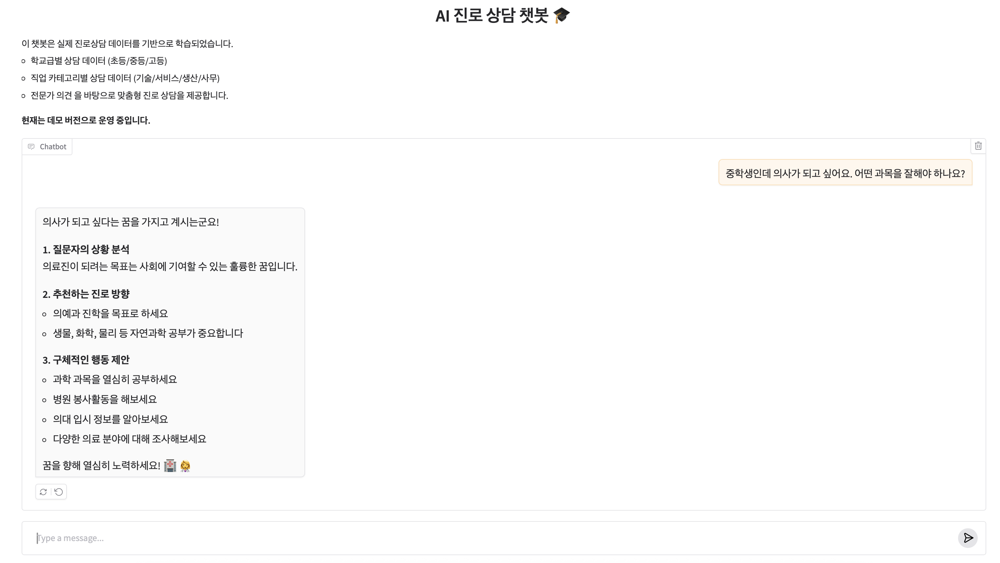

**AI 기반 진로 상담 서비스로, 실제 진로상담 전문가의 데이터를 활용하여 개인 맞춤형 진로 상담을 제공합니다.**

</div>

## 🎯 프로젝트 컨셉

### 핵심 아이디어
이 프로젝트는 **전문가 진로상담 데이터**를 AI 기술과 결합하여, 학생들이 언제든지 접근할 수 있는 **24/7 진로 상담 서비스**를 구현하는 것입니다.

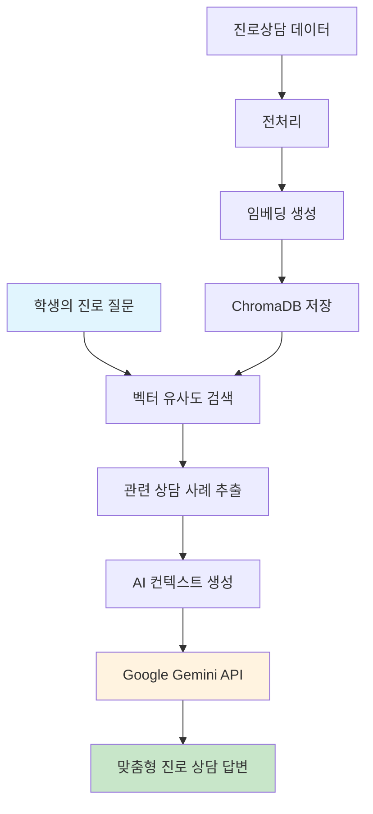

### 기술적 혁신점
- **RAG (Retrieval-Augmented Generation)**: 실제 상담 사례를 검색하여 AI 응답의 품질 향상
- **다층 데이터 구조**: 학교급별, 직업카테고리별 세분화된 상담 데이터 활용
- **의미적 검색**: 벡터 임베딩을 통한 질문 의도 파악 및 관련 사례 매칭

## 🏗️ 시스템 아키텍처

```mermaid
architecture-beta
    group api(cloud)[External APIs]
    service gemini(internet)[Google Gemini API] in api
    
    group frontend(browser)[Frontend Layer]
    service gradio(server)[Gradio Web Interface] in frontend
    
    group backend(server)[Backend Services]  
    service chatbot(server)[Career Chatbot] in backend
    service embeddings(server)[Embedding Service] in backend
    service db_handler(server)[Database Handler] in backend
    
    group storage(disk)[Data Storage]
    service sqlite(database)[SQLite Database] in storage
    service chroma(database)[ChromaDB Vector Store] in storage
    service models(disk)[Local ML Models] in storage
    
    group data(disk)[Raw Data]
    service json_data(disk)[Career Counseling JSON] in data
    
    gradio:R --> L:chatbot
    chatbot:R --> L:embeddings
    chatbot:R --> L:gemini
    embeddings:B --> T:chroma
    db_handler:B --> T:sqlite
    db_handler:T --> B:json_data
    embeddings:B --> T:models
```

## 🔧 기술 스택 상세

### Core Technologies
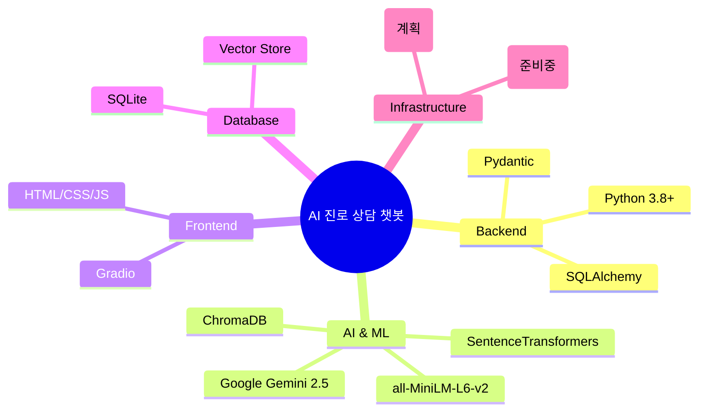

### 데이터 플로우
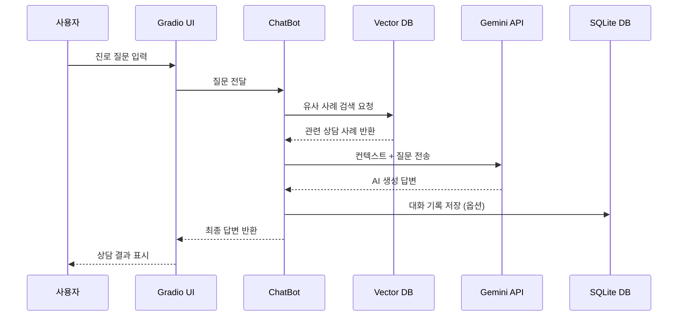

## 프로젝트 개요

이 프로젝트는 실제 진로상담 데이터를 기반으로 학습된 AI 챗봇을 통해 학생들에게 맞춤형 진로 상담을 제공하는 웹 애플리케이션입니다.

### 주요 기능

- 📚 **학교급별 맞춤 상담**: 초등학교, 중학교, 고등학교별 특화 상담
- 💼 **직업 카테고리별 상담**: 기술계열, 서비스계열, 생산계열, 사무계열 전문 상담
- 🔍 **유사 사례 검색**: 벡터 데이터베이스를 활용한 유사 상담 사례 검색
- 🤖 **AI 기반 응답**: Gemini API를 활용한 자연스러운 대화형 상담

### 주요 특징

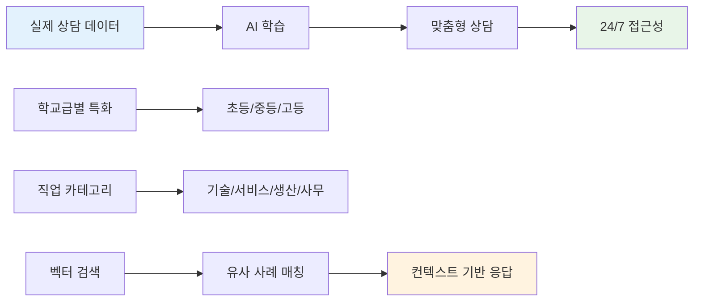

### 🛠️ 기술 스택

| 분야 | 기술 | 버전/설명 |
|------|------|-----------|
| **Backend** | Python | 3.8+ |
| **AI Model** | Google Gemini | 2.5-Flash |
| **Embedding** | SentenceTransformer | all-MiniLM-L6-v2 |
| **Vector DB** | ChromaDB | 벡터 유사도 검색 |
| **Web Framework** | Gradio | 대화형 웹 인터페이스 |
| **Database** | SQLite | 구조화된 데이터 저장 |
| **Environment** | python-dotenv | 환경변수 관리 |

## 설치 및 실행 방법

### 1. 환경 설정

```bash
# 프로젝트 클론
git clone <repository-url>
cd career_consult

# 가상환경 생성 (선택사항)
python -m venv venv
source venv/bin/activate  # macOS/Linux
# 또는
venv\Scripts\activate  # Windows

# 패키지 설치
pip install -r requirements.txt
```

### 2. 환경 변수 설정

`.env` 파일을 생성하고 다음 내용을 추가하세요:

```env
# Gemini API 키 (필수)
GOOGLE_API_KEY=your_gemini_api_key_here

# 모델 설정
GEMINI_MODEL_NAME=gemini-1.5-flash
GEMINI_TEMPERATURE=0.2
GEMINI_MAX_OUTPUT_TOKENS=1024

# ChromaDB 경로 (선택사항)
CHROMA_DB_PATH=./app/chroma_db
```

### 3. 모델 다운로드

```bash
cd app
python download_models.py
```

### 4. 데이터베이스 초기 설정

```bash
# 데이터베이스 생성 및 데이터 임포트
python database_handler.py

# 벡터 임베딩 생성
python create_embeddings.py
```

### 5. 애플리케이션 실행

```bash
# GUI 실행
python gui.py

# 또는 터미널에서 직접 챗봇 테스트
python career_chatbot.py
```

웹 브라우저에서 `http://localhost:7860`으로 접속하여 사용할 수 있습니다.

## 📁 프로젝트 구조

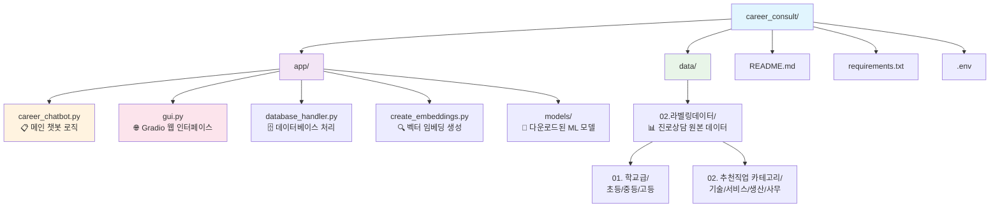

### 주요 컴포넌트

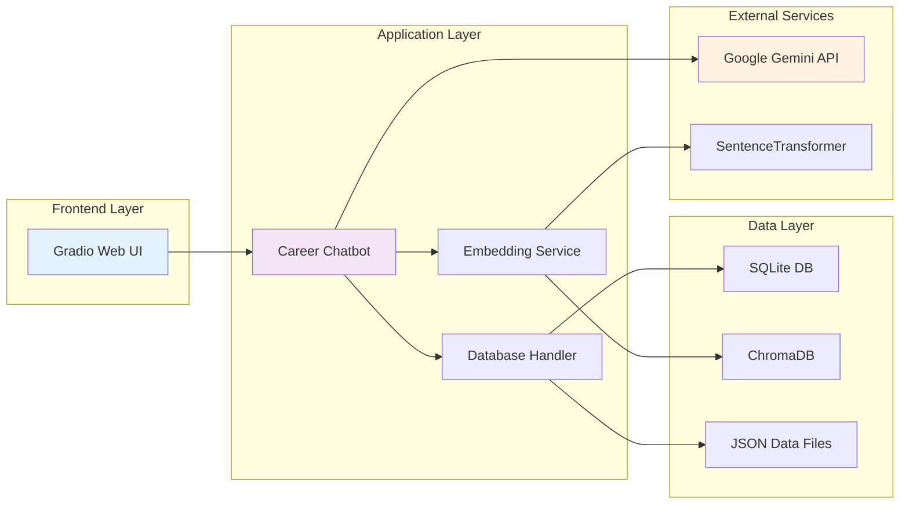

## 📊 개발 현황

### 프로젝트 진행률

```mermaid
gantt
    title AI 진로 상담 챗봇 개발 로드맵
    dateFormat  X
    axisFormat %s
    
    section 기반 구축
    데이터 수집/전처리     :done, data, 0, 3
    벡터 DB 구축          :done, vector, 2, 4
    기본 챗봇 아키텍처     :done, arch, 3, 5
    
    section 핵심 기능
    AI 모델 연동          :done, ai, 4, 6
    웹 인터페이스         :done, web, 5, 7
    유사 사례 검색        :done, search, 6, 8
    
    section 개선 작업
    응답 품질 향상        :active, quality, 7, 10
    사용자 피드백         :feedback, 8, 11
    성능 최적화          :perf, 9, 12
    
    section 확장 기능
    다중 사용자 지원      :multi, 10, 13
    API 서버 개발        :api, 11, 14
    클라우드 배포        :cloud, 12, 15
```

### ✅ 완료된 기능
- [x] 기본 챗봇 아키텍처 구성
- [x] 데이터 전처리 및 임베딩 생성
- [x] ChromaDB 벡터 데이터베이스 구축
- [x] Gemini API 연동
- [x] Gradio 웹 인터페이스 구현
- [x] 학교급별/직업카테고리별 데이터 분류
- [x] 유사 사례 검색 기능
- [x] 기본 대화형 상담 기능

### 🔄 개발 중
- [ ] 응답 품질 개선 및 프롬프트 엔지니어링
- [ ] 사용자 피드백 수집 시스템
- [ ] 대화 기록 저장 및 관리

### 🎯 성능 지표

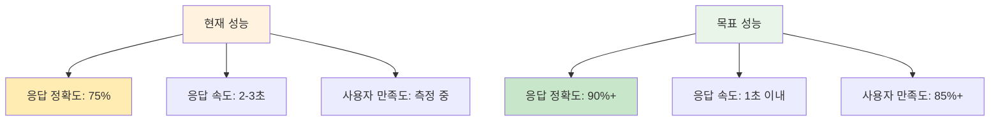

### 📋 향후 개발 계획

#### 단기 목표 (1-2개월)
- [ ] **응답 품질 개선**
  - 더 정확하고 맞춤형 답변을 위한 프롬프트 최적화
  - 컨텍스트 윈도우 관리 개선
  - 답변 일관성 향상

- [ ] **사용자 경험 개선**
  - 대화 히스토리 관리 기능
  - 사용자 만족도 평가 시스템
  - 더 직관적인 UI/UX 개선

- [ ] **데이터 관리**
  - 추가 진로상담 데이터 수집 및 통합
  - 데이터 품질 관리 시스템
  - 지속적인 데이터 업데이트 체계

#### 중기 목표 (3-6개월)
- [ ] **고급 기능 개발**
  - 개인 맞춤형 프로필 시스템
  - 진로 추천 알고리즘 개선
  - 멀티모달 입력 지원 (이미지, 음성)

- [ ] **확장성 개선**
  - 클라우드 배포 (AWS/GCP)
  - 다중 사용자 지원
  - API 서버 개발

- [ ] **분석 및 모니터링**
  - 사용자 행동 분석 대시보드
  - 상담 효과 측정 시스템
  - 성능 모니터링 도구

#### 장기 목표 (6개월 이상)
- [ ] **AI 모델 고도화**
  - 자체 진로상담 특화 모델 개발
  - 연속 학습 시스템 구축
  - 다국어 지원

- [ ] **생태계 확장**
  - 학교/기관 연동 시스템
  - 진로 전문가 연결 플랫폼
  - 실시간 상담 예약 시스템

- [ ] **상용화 준비**
  - 보안 강화
  - 개인정보 보호 시스템
  - 상업적 서비스 모델 개발

## 🖥️ 사용법 및 데모

### 📸 실행 화면 스크린샷

#### 메인 인터페이스
챗봇 실행 후 `http://localhost:7860`에 접속하면 다음과 같은 화면을 볼 수 있습니다:

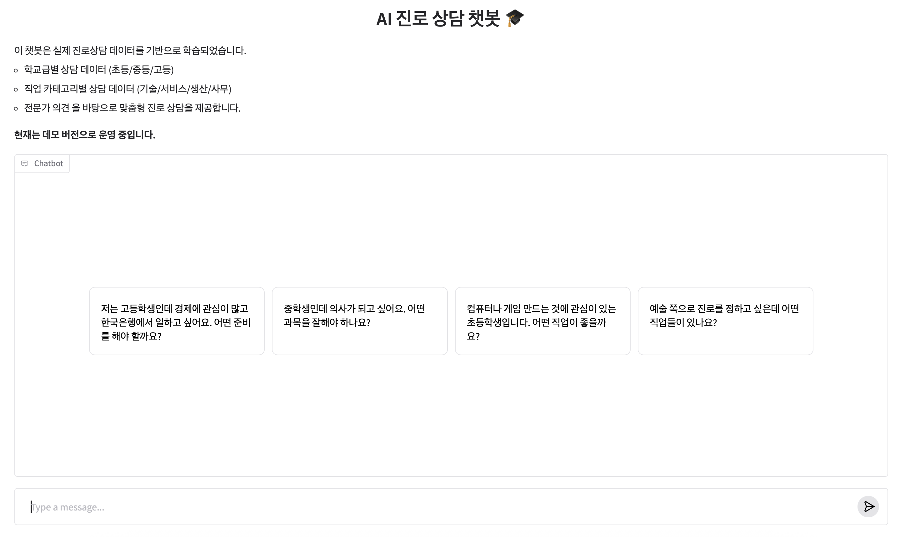

*깔끔하고 직관적인 Gradio 웹 인터페이스로, 학생들이 쉽게 접근할 수 있도록 설계되었습니다.*

#### 대화 진행 화면
실제 상담이 진행되는 모습입니다:


*실시간으로 진로 상담이 이루어지는 모습으로, AI가 학생의 질문에 맞춤형 답변을 제공합니다.*

### 사용 플로우

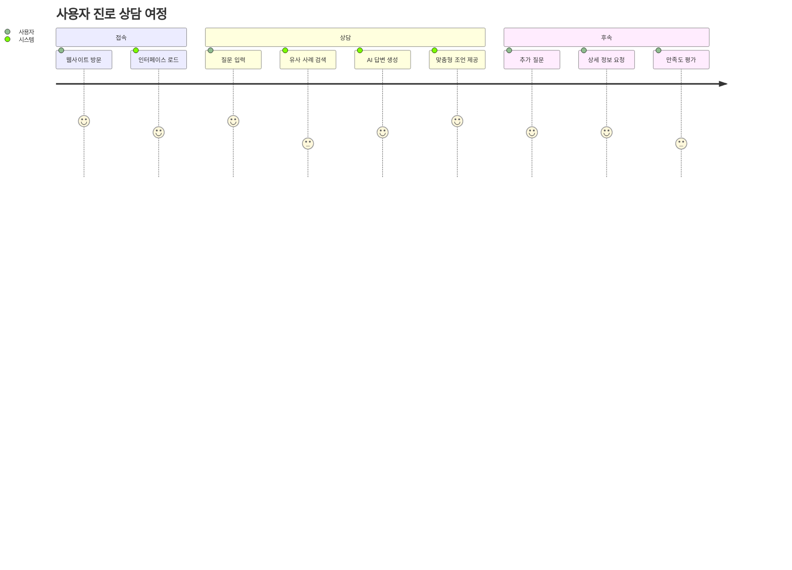

### 🎬 데모 갤러리

<div align="center">

| 메인 인터페이스 | 상담 진행 화면 |
|:---:|:---:|
|  |  |
| 사용자 친화적인 웹 인터페이스 | 실시간 AI 진로 상담 |

</div>

### 📱 주요 기능 시연

#### 1. 학교급별 맞춤 상담
```
🎓 고등학생: "경제학과 한국은행에 관심이 있어요"
🤖 챗봇: 경제학과 진학 가이드, 한국은행 채용 정보, 필요 과목 안내

📚 중학생: "의사가 되고 싶어요"  
🤖 챗봇: 의예과 진학 정보, 과학 과목 중요성, 봉사활동 추천

🏫 초등학생: "게임 만드는 사람이 되고 싶어요"
🤖 챗봇: 프로그래밍 입문 가이드, 관련 학과 소개, 체험 활동 추천
```

#### 2. 실시간 대화형 상담
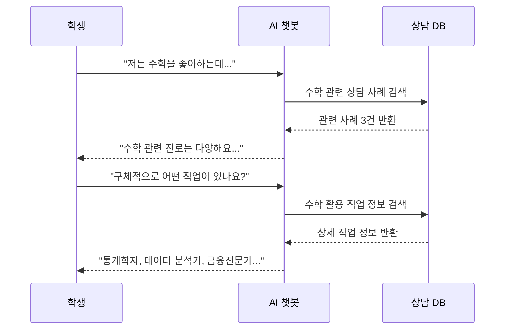

## 🔧 기술적 세부사항

### RAG (Retrieval-Augmented Generation) 구현
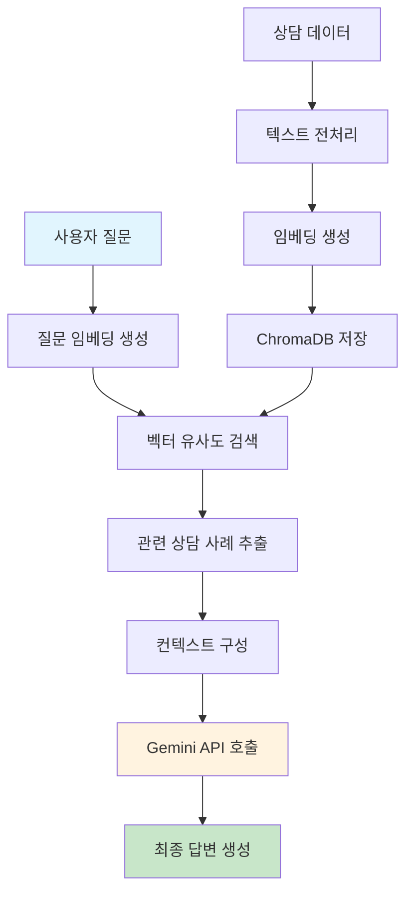

### 성능 최적화 전략
- **벡터 검색 최적화**: 상위 K개 유사 문서만 검색하여 응답 속도 향상
- **캐싱 시스템**: 자주 묻는 질문에 대한 응답 캐싱
- **배치 처리**: 대량 데이터 처리 시 배치 단위로 임베딩 생성

### 데이터 보안 및 프라이버시
- 사용자 질문은 세션 종료 시 자동 삭제
- API 키는 환경변수로 안전하게 관리
- 개인정보는 수집하지 않음

## 🤝 기여하기

### 개발 환경 설정
```bash
# 개발용 의존성 설치
pip install -r requirements-dev.txt

# 코드 품질 검사
black . --check
flake8 .
mypy .

# 테스트 실행
pytest tests/
```

### 기여 워크플로우
```mermaid
gitgraph
    commit id: "Main"
    branch feature/new-feature
    checkout feature/new-feature
    commit id: "개발 시작"
    commit id: "기능 구현"
    commit id: "테스트 작성"
    checkout main
    merge feature/new-feature
    commit id: "PR 머지"
```

1. Fork the repository
2. Create your feature branch (`git checkout -b feature/AmazingFeature`)
3. Commit your changes (`git commit -m 'Add some AmazingFeature'`)
4. Push to the branch (`git push origin feature/AmazingFeature`)
5. Open a Pull Request

## 📄 라이선스

이 프로젝트는 MIT 라이선스를 따릅니다. 자세한 내용은 `LICENSE` 파일을 참조하세요.

[](https://opensource.org/licenses/MIT)

## 📞 문의하기

### 👨‍💻 프로젝트 관리자 연락처

| 항목 | 정보 |
|------|------|
| **이름** | 임현근 (Hyun-Keun Lim) |
| **Email** | hyun.lim@okkorea.net |
| **GitHub** | [프로젝트 저장소](https://github.com/username/career_consult) |
| **Last Updated** | 2025년 7월 5일 |

### 💬 지원 채널
- 🐛 **버그 신고**: GitHub Issues를 통해 신고해 주세요
- 💡 **기능 제안**: GitHub Discussions에서 아이디어를 공유해 주세요
- 📧 **일반 문의**: 이메일로 직접 연락 가능합니다
- 📚 **사용법 질문**: README 문서를 먼저 확인해 주세요


## ⚠️ 중요 참고사항

| 구분 | 요구사항 | 설명 |
|------|----------|------|
| **API** | Google Gemini API 키 | 필수 환경변수 설정 |
| **저장공간** | 최소 2GB | 모델 및 임베딩 데이터 |
| **메모리** | 4GB+ 권장 | 벡터 검색 및 AI 모델 로딩 |
| **Python** | 3.8+ | 최신 버전 권장 |

### 🚀 빠른 시작 체크리스트
- [ ] Python 3.8+ 설치 확인
- [ ] Google Gemini API 키 발급
- [ ] 의존성 패키지 설치
- [ ] 환경변수 설정 (`.env` 파일)
- [ ] 모델 다운로드 실행
- [ ] 데이터베이스 초기화
- [ ] 웹 서버 실행 (`python app/simple_gui.py`)

---

<div align="center">

### 📱 실행 결과 미리보기

| 시작 화면 | 상담 진행 |
|:---:|:---:|
|  |  |

**🎓 모든 학생들의 꿈을 응원합니다! 🌟**

Made with ❤️ for Education

### ⭐ 이 프로젝트가 도움이 되었다면 Star를 눌러주세요!

</div>
